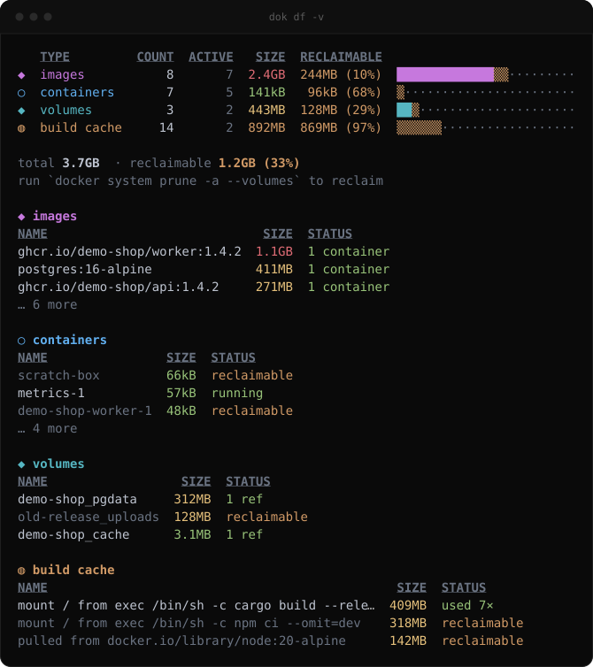
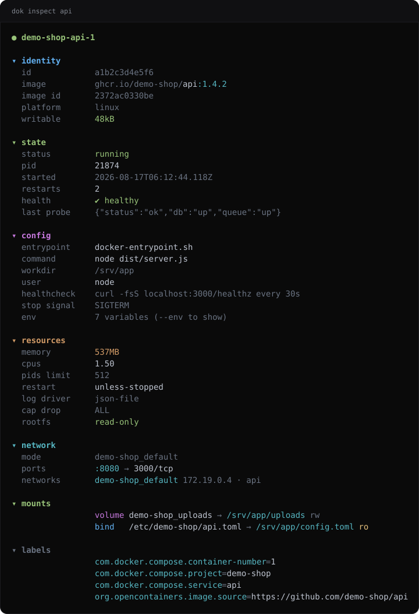
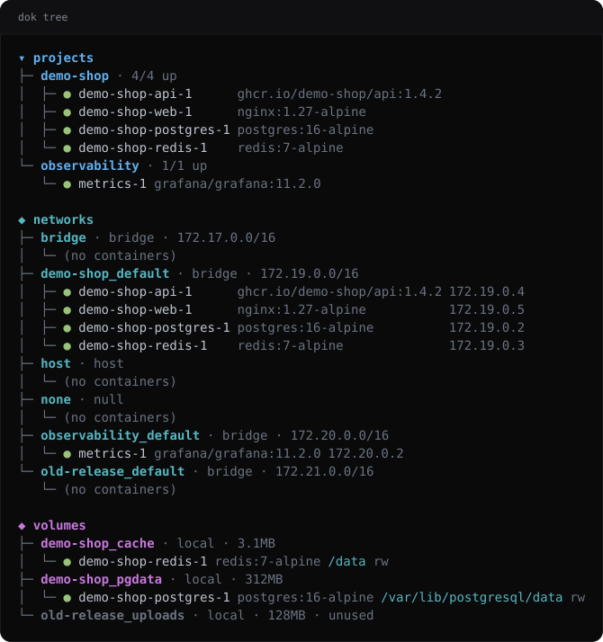
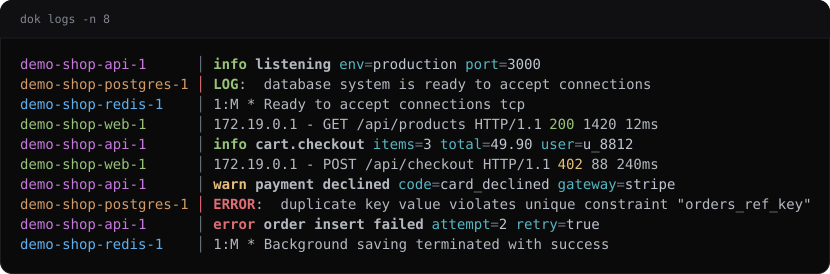
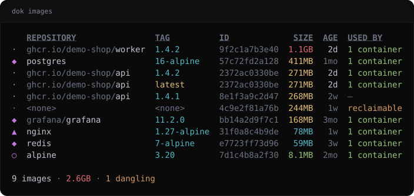
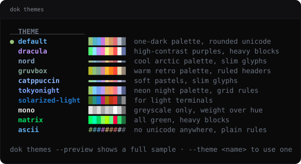

<div align="center">

# dok

**Docker output, made readable — what [eza](https://eza.rocks/) is to `ls`.**

One binary: **`dok`**.

[](https://github.com/alsaadii98/dok/actions/workflows/ci.yml)
[](https://github.com/alsaadii98/dok/releases)
[](https://crates.io/crates/dok-cli)
[](LICENSE)


</div>

## What it is

`docker ps` prints a wall of text that wraps on any normal terminal. `docker
inspect` prints 400 lines of JSON. `docker system df` gives you a number but not
the image that ate the disk.

`dok` — the single binary this repo ships — reads the same data straight from
the Docker socket, no shelling out, and renders it for humans:

- **Colour and icons that mean something**: state, health, size, age.
- **Grouped by compose project**, showing the service name rather than the
  mangled container name.
- **Human sizes and ages** (`1.1GB`, `3h`), not raw bytes and timestamps.
- **Themes** that change palette, glyphs *and* layout — including a pure-ASCII
  one for CI logs and serial consoles.
- **One static screen per command**, so it pipes, greps and scrolls like any
  other Unix tool. No full-screen app to live in (except `dok stats`, which is
  explicitly a dashboard).

## Install

<details open>
<summary><b>Homebrew</b> (macOS, Linux)</summary>

```sh
brew install alsaadii98/tap/dok
```
</details>

<details>
<summary><b>Cargo</b> (any platform with Rust 1.88+)</summary>

```sh
cargo install dok-cli
```

The crate is `dok-cli`; the binary it installs is `dok`.
</details>

<details>
<summary><b>Arch Linux</b></summary>

Build with `makepkg` from the PKGBUILDs in this repo — `dok-bin` installs the
prebuilt static binary, `dok` builds from source:

```sh
git clone https://github.com/alsaadii98/dok
cd dok/packaging/aur
makepkg -si -p PKGBUILD-bin   # prebuilt binary, no rust needed
makepkg -si                   # build from source
```

Both are the same packages that will be published to the AUR.
</details>

<details>
<summary><b>Debian / Ubuntu</b></summary>

```sh
curl -LO https://github.com/alsaadii98/dok/releases/latest/download/dok_amd64.deb
sudo dpkg -i dok_amd64.deb
```
</details>

<details>
<summary><b>Fedora / RHEL</b></summary>

```sh
curl -LO https://github.com/alsaadii98/dok/releases/latest/download/dok.x86_64.rpm
sudo rpm -i dok.x86_64.rpm
```
</details>

<details>
<summary><b>Alpine Linux</b></summary>

```sh
wget https://github.com/alsaadii98/dok/releases/latest/download/dok-x86_64.apk
apk add --allow-untrusted ./dok-x86_64.apk
```

`aarch64` packages are published under the same name. The package is signed
with a per-release key that is not in Alpine's keyring, which is what
`--allow-untrusted` is for; the binary is static musl, so it pulls in no
dependencies.
</details>

<details>
<summary><b>Nix</b></summary>

```sh
nix run github:alsaadii98/dok
nix profile install github:alsaadii98/dok
```
</details>

<details>
<summary><b>Windows</b> (Scoop)</summary>

```powershell
scoop bucket add dok https://github.com/alsaadii98/dok
scoop install dok/dok
```

This repository doubles as a scoop bucket; the manifest is `bucket/dok.json`.
</details>

<details>
<summary><b>Prebuilt binary</b></summary>

Grab the archive for your platform from the
[releases page](https://github.com/alsaadii98/dok/releases):

```sh
tar xzf dok-*.tar.gz
sudo mv dok /usr/local/bin/
```
</details>

<details>
<summary><b>From source</b></summary>

```sh
git clone https://github.com/alsaadii98/dok
cd dok
cargo build --release
sudo cp target/release/dok /usr/local/bin/
```
</details>

**Try it without a daemon:** every command takes `--demo`, which renders a
built-in example stack. That is also how the screenshots in this README are
generated, so they never leak anyone's real containers.

```sh
dok ps -a --demo
dok df -v --demo
```

**Requirements:** a reachable Docker daemon. `dok` honours `DOCKER_HOST`, the
default `/var/run/docker.sock`, and Windows named pipes. Nothing else.

## Commands

| Command | What it does |
|---|---|
| `dok ps` (`ls`) | Containers grouped by compose project — id, state dot, health mark, `:8080→80` ports, relative age |
| `dok ports` | Every published port in one table, sorted by port — answers "who owns 5432?" |
| `dok health` | Only containers with a healthcheck — status, failing streak, last probe |
| `dok history <image>` | Image layers with size bars and readable Dockerfile instructions |
| `dok images` (`img`) | Images with size and age gradients, dangling marked reclaimable |
| `dok df` (`du`) | Disk usage per category with used/reclaimable bars, plus the biggest offenders |
| `dok prune` | What `docker system prune` would remove, grouped and sized — never removes anything |
| `dok inspect` | The 400-line inspect JSON folded into readable sections, secrets masked |
| `dok logs` | Interleaved multi-container tail with level colouring and JSON pretty-printing |
| `dok top` | Processes inside containers, nested by parent PID |
| `dok tree` | Compose projects, networks (with IPs) and volumes (with mount points) |
| `dok stats` | Live CPU / memory / IO dashboard |
| `dok events` | Daemon event stream, colour-coded by type and action |
| `dok themes` | List and preview themes |
| `dok update` | Check for a newer release and install it in place |
| `dok uninstall` | Remove dok, or print the exact command that does |

<details>
<summary><b>dok ports</b> — who owns 5432?</summary>

```sh
dok ports             # every published port, sorted by port
dok ports -a          # include stopped containers
dok ports | grep 5432
```

`docker ps` spreads ports down a column, wrapped and interleaved with
everything else. `dok ports` is one row per published binding, sorted by host
port, so the lookup is a glance.

Exposed-but-unpublished ports are left out — nothing on the host can reach
them. A wildcard binding that docker reports twice, once for IPv4 and once for
IPv6, collapses into the single row you meant by it. The `BIND` column appears
only when some binding is narrower than "every interface". When two containers
claim the same address, port and protocol, both rows are marked.
</details>

<details>
<summary><b>dok health</b> — what is actually failing</summary>

```sh
dok health            # every container that declares a healthcheck
dok health -u         # only the ones failing
dok health -a         # include stopped containers
```

`docker ps` shows `(healthy)` inside a status string and nothing else. The
three things worth knowing when a check fails — how long it has been failing,
what the probe printed, and how often it runs — are several hundred lines apart
in `docker inspect`. Unhealthy sorts first.

```
   CONTAINER  PROJECT        HEALTH     FAILING  EVERY  LAST PROBE
✖  grafana    observability  unhealthy        7    30s  exit 1 curl: (7) Failed to connect…
✔  api        demo-shop      healthy          0    30s  {"status":"ok","db":"up"}
✔  postgres   demo-shop      healthy          0    30s  accepting connections

2 healthy · 1 unhealthy · 2 without a healthcheck
<summary><b>dok history</b> — which layer made it big</summary>

```sh
dok history api           # build order, top-down like the Dockerfile
dok history api -r        # newest first, the way docker prints it
dok history api --no-trunc
```

`docker history` prints the right data in the wrong order and hides the
instruction behind `/bin/sh -c #(nop)`. This reads top-down the way the
Dockerfile was written, recovers the instruction from the classic builder and
BuildKit alike, and marks every layer over 10% of the image.

```
   #   SIZE                AGE  INSTRUCTION
◆  1  145MB  ███████·····  1mo  ADD file:9a2c in /
   2     0B  ············  1mo  ENV NODE_VERSION=22.9.0
   3  8.9MB  █···········  1mo  RUN apk add --no-cache tini
   4     0B  ············   2d  WORKDIR /app
◆  5   96MB  ████········   2d  RUN npm ci --omit=dev
```
</details>

<details>
<summary><b>dok prune</b> — what would go, before it goes</summary>

```sh
dok prune             # what `docker system prune` would take
dok prune -a          # count every unused image, not only dangling ones
dok prune --volumes   # include unused volumes
```

dok reads, docker writes — this never deletes anything. It shows the exact set
`docker system prune` would remove, grouped by kind and sized, then prints the
docker command that does it. The one thing a preview has to get right is the
boundary: without `-a`, docker takes *dangling* images and leaves a tagged
image that nothing runs alone. The same flag here draws the same line.

```
◆ containers  2 stopped · 114kB
├─  scratch-box                                  66kB  created
└─  demo-shop-worker-1                           48kB  exited
◆ images  1 dangling · 244MB
└─  <none> 4c9e2f81a76b                         244MB  0 containers
◆ networks  1 unused
└─  old-release_default                             —  bridge
◆ build cache  2 unused · 460MB
├─  mount / from exec /bin/sh -c npm ci --o…    318MB  used 2×
└─  pulled from docker.io/library/node:20-a…    142MB  used 3×

704MB reclaimable · 6 items · nothing was removed

  $ docker system prune
```
</details>

<details>
<summary><b>dok df</b> — where the disk went</summary>



```sh
dok df                # summary with used|reclaimable bars
dok df -v             # + biggest images, containers, volumes, cache entries
dok df -v --top 20
```
</details>

<details>
<summary><b>dok inspect</b> — the JSON, folded</summary>



```sh
dok inspect api
dok inspect api --env                 # include environment variables
dok inspect api --env --show-secrets  # unmask PASSWORD/TOKEN/... values
```

Values of credential-looking env keys are masked by default. Privileged mode,
added capabilities, OOM kills and failing healthchecks are called out in colour.
</details>

<details>
<summary><b>dok tree</b> — projects, networks, volumes</summary>



```sh
dok tree
dok tree --only networks
dok tree -a           # include stopped containers
```
</details>

<details>
<summary><b>dok logs</b> — merged and level-coloured</summary>



```sh
dok logs                  # tail every running container
dok logs api db -f        # follow two of them
dok logs api -n 200 -t    # 200 lines with timestamps
dok logs api -g error     # filter to matching lines
```

Each container keeps a stable colour. The `│` separator turns red for stderr.
JSON lines are exploded into `level msg key=value …`.
</details>

<details>
<summary><b>dok images</b></summary>



```sh
dok images            # sorted by size, biggest first
dok images -s age
dok images --dangling
```
</details>

<details>
<summary><b>dok events / top / stats</b></summary>

```sh
dok events --since 2h            # relative durations work
dok events -T container,volume   # restrict to object types
dok events --exec                # include noisy exec_* events

dok top                          # processes in every running container
dok top api --ps-args "-eo pid,ppid,rss,args"

dok stats                        # live dashboard; q quits, s cycles sort
```
</details>

## Themes

A theme is not just colour. It carries a **palette** (nine semantic roles), a
**glyph set** (state dots, tree stubs, bars, arrows, separators) and a
**layout** (header treatment, gutter width, rules, column separators).



```sh
dok themes              # list with swatches
dok themes --preview    # full sample table per theme
dok ps --theme gruvbox
DOK_THEME=nord dok ps
```

Built in: `default`, `dracula`, `nord`, `gruvbox`, `catppuccin`, `tokyonight`,
`solarized-light`, `mono`, `matrix`, `ascii`.

## Configuration

```sh
dok themes --init       # writes ~/.config/dok/config.toml
```

```toml
theme = "mine"
icons = "nerd"          # auto | nerd | unicode | none

[themes.mine]
base = "gruvbox"        # start from any built-in
glyphs = "heavy"        # unicode | ascii | heavy | slim
layout = "grid"         # default | ruled | grid | quiet | ascii
header = "dim"          # underline | bold | dim | caps
gutter = 3
green = "#00ff00"       # override any palette role
```

Theme precedence: `--theme` → `DOK_THEME` → config file → `default`.

Global flags, valid on every command:

```
--color auto|always|never       # auto respects NO_COLOR and non-tty output
--icons auto|nerd|unicode|none  # auto picks nerd glyphs on capable terminals
--theme <name>
```

Set `DOK_NERD_FONT=1` to force Nerd Font glyphs, `DOK_NERD_FONT=0` to refuse
them, and `DOK_NO_UPDATE_CHECK=1` to stop dok looking for new releases.

## Staying current

dok checks GitHub for a newer release at most once a day and, when there is
one, prints a single dim line after the output it was already going to print:

```
dok 0.1.5 is out (you have 0.1.4) — run `dok update`
```

```sh
dok update --check      # say what is available, install nothing
dok update              # install it, after asking
dok update -y           # install it without asking
```

If dok was installed by a package manager it says so and prints that manager's
upgrade command instead of overwriting a file it does not own. A standalone
binary is replaced in place: dok downloads the archive for its own target,
verifies the release checksum, and only then moves the new binary over the old
one. Add `sudo` if the binary lives somewhere you cannot write.

The check needs `curl` or `wget`; without either it stays silent. Set
`DOK_NO_UPDATE_CHECK=1` to switch it off, and note it never runs when output
is piped or when `--demo` is on.

## Uninstalling

```sh
dok uninstall             # remove the binary, keep the config
dok uninstall --purge     # also remove ~/.config/dok and ~/.cache/dok
dok uninstall --dry-run   # list what would go, remove nothing
dok uninstall -y          # do not ask
```

`dok uninstall` works the same way `dok update` does: it finds out how dok got
onto the machine and acts accordingly. A standalone binary deletes itself. A
packaged one is left alone and the manager's own removal command is printed —
`brew uninstall dok`, `scoop uninstall dok`, `cargo uninstall dok-cli`,
`nix profile remove dok`, `sudo pacman -Rns dok`, `sudo apk del dok`,
`sudo dpkg -r dok`, `sudo rpm -e dok` — because a package database that no
longer matches the disk is worse than a binary that is still there. `--purge`
still cleans up dok's own directories in that case.

dok only ever deletes what it wrote: the binary, its scoop shims, and the two
directories above. Add `sudo` if the binary lives somewhere you cannot write.

## How it compares

| | `dok` | `docker ps --format` | [dops](https://github.com/Mikescher/better-docker-ps) | [lazydocker](https://github.com/jesseduffield/lazydocker) / [oxker](https://github.com/mrjackwills/oxker) |
|---|---|---|---|---|
| Static, pipeable output | ✔ | ✔ | ✔ | ✘ (full-screen TUI) |
| Compose grouping | ✔ | ✘ | ✘ | partial |
| Readable `inspect` | ✔ | ✘ | ✘ | partial |
| Disk usage breakdown | ✔ | ✘ | ✘ | partial |
| Themes (palette + glyphs + layout) | ✔ | ✘ | ✘ | ✘ |
| Interactive control (exec, restart) | ✘ | ✘ | ✘ | ✔ |

`dok` is not trying to replace lazydocker — use that when you want to *drive*
containers, and `dok` when you want to *read* them.

## Contributing

Issues and PRs welcome — see [CONTRIBUTING.md](CONTRIBUTING.md) for the dev
loop, and [ROADMAP.md](ROADMAP.md) for what is planned and what is up for grabs.

```sh
cargo fmt --all
cargo clippy --all-targets -- -D warnings
cargo test
```

## License

MIT - Built by [@alsaadii98](https://github.com/alsaadii98). See [LICENSE](LICENSE).
